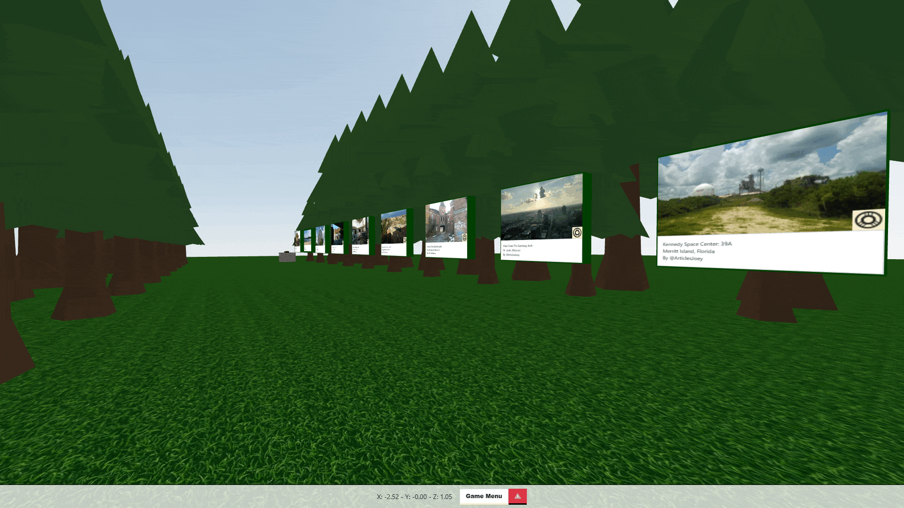

# Assets Gallery



Online gallery build with Three.js and React Three Fiber. View images and models submitted via a website inside a 3D space with the ability to walk around.

## Getting Started

First, run the development server:

```bash
npm run dev
```

## Multiplayer

Going to add websocket multiplayer to allow others to see where other people are in the gallery

## TODO

- Add multiplayer socket code from articles-express
- Fallback offline img/model toggle for educational learning, maybe even on by default and disabled via env for minimum friction when downloading project. 

## Attributions

[Easel Icon - Flaticon](https://www.flaticon.com/free-icon/easel_2784489)  
[Alley Model](https://sketchfab.com/3d-models/alley-c463c94475644aeda18bc3ae95b08d2b)  
[Modern Bench](https://sketchfab.com/3d-models/modern-bench-1-caa4515e36444e4c8c100296463e83c1#download)  
[Park Bench](https://sketchfab.com/3d-models/lowpoly-park-bench-game-asset-34b84238f27f4407b65fe03a8774c574#download)
[Grass Texture](https://www.poliigon.com/texture/flat-grass-texture/4585)