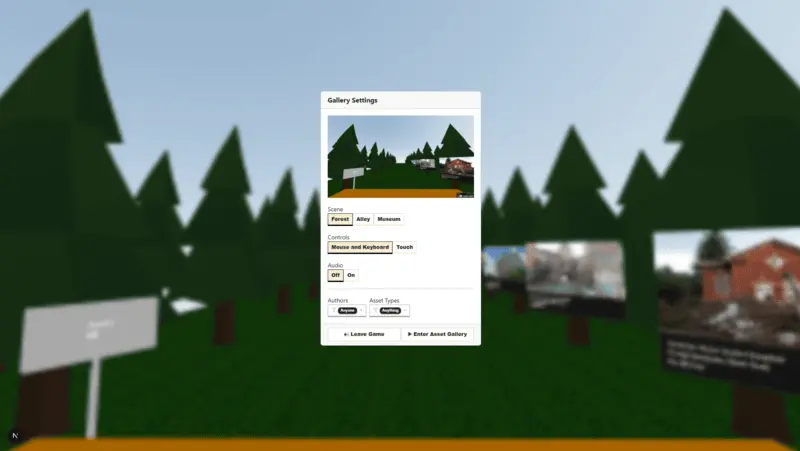

# Assets Gallery



Online gallery build with Three.js and React Three Fiber. View images and models submitted via a website inside a 3D space with the ability to walk around.

## Getting Started

First, run the development server:

```bash
npm run dev
```

## Multiplayer

Aiming to have multiplayer via P2P and Websockets. Websocket backend code is not in this repo or available at this time. P2P code will be included here.